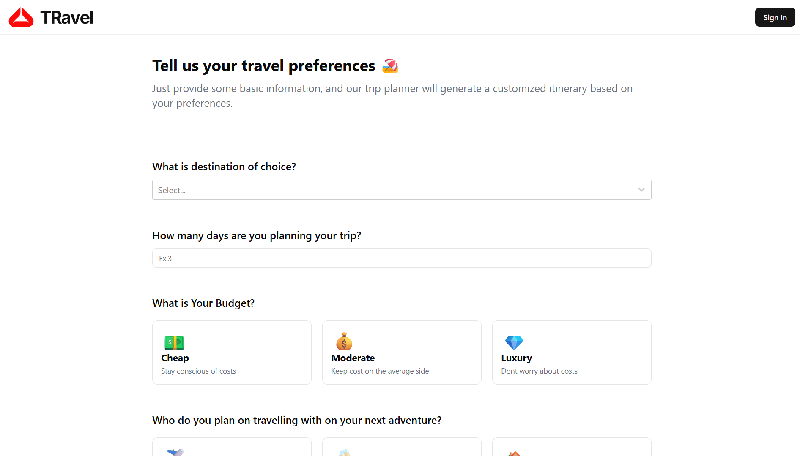
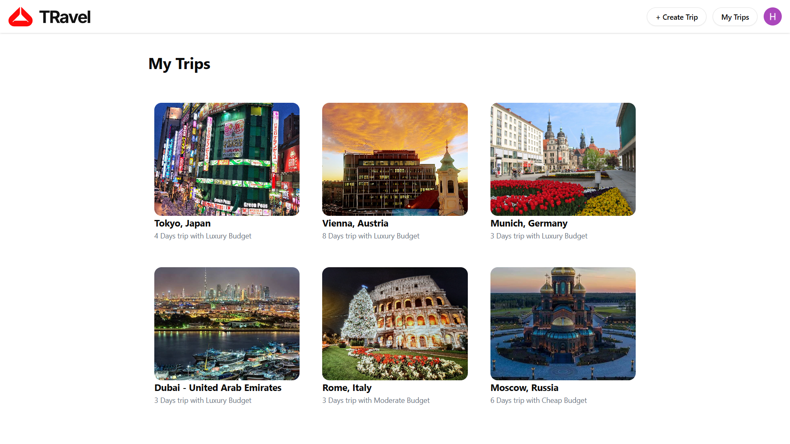

# 🌍 TRavel – AI-Powered Trip Planner ✈️

A smart travel itinerary planner that leverages Google’s Gemini AI to generate personalized, day-wise travel plans based on user preferences. Built with React, Firebase, and Tailwind CSS.

 

## 🖼️ Screenshots

### 🏠 Home Page
A welcoming landing page with app introduction and Google Sign-In.

### ✍️ Create Trip Page
Form where users input destination, duration, budget, and interests.

### 🧳 Itinerary Page
AI-generated day-wise travel plans with activities and hotel suggestions.

### 📁 My Trips Page
A dashboard to view, revisit, or manage previously saved trips.

 

## ✨ Features

- 🔐 Google Sign-In using Firebase Authentication
- 🗺️ Plan trips by entering destination, duration, budget, and interests
- 🤖 Uses Gemini AI to generate detailed itineraries
- 🏨 Shows hotel suggestions and day-wise activities
- 💾 Save and view past trips via Firebase Firestore
- 📍 Interactive Google Maps for trip visualization
- 🎨 Fully responsive UI using Tailwind CSS
- ☁️ Deployed with Vercel

 

## 🧰 Tech Stack

- **Frontend:** React (Vite), Tailwind CSS
- **AI Integration:** Google Gemini API
- **Backend/Database:** Firebase (Auth + Firestore)
- **Deployment:** Vercel
